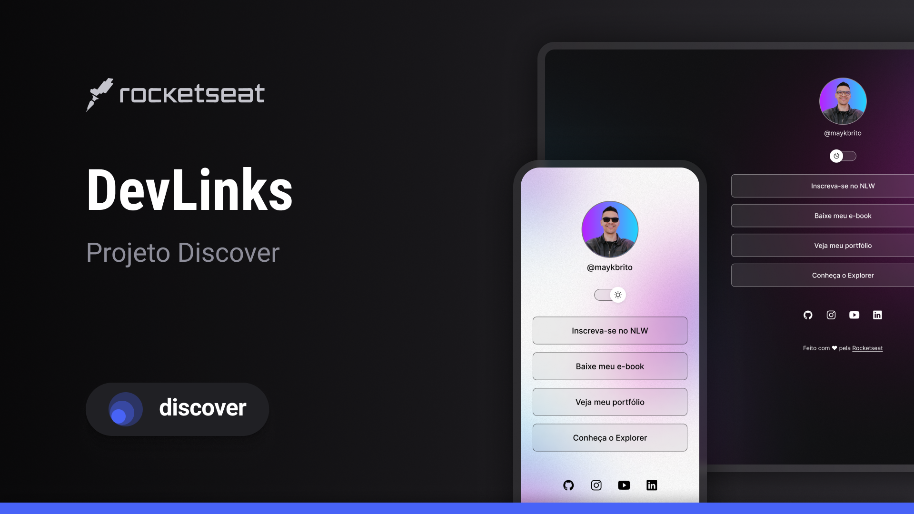

<h1 align="center"> DevLinks </h1>

Meu primeiro projeto de desenvolvimento web, com o auxílio do curso da RocketSeat.

  <a href="#-tecnologias">Tecnologias</a>&nbsp;&nbsp;&nbsp;|&nbsp;&nbsp;&nbsp;
  <a href="#-projeto">Projeto</a>&nbsp;&nbsp;&nbsp;|&nbsp;&nbsp;&nbsp;
  <a href="#-layout">Layout</a>&nbsp;&nbsp;&nbsp;|&nbsp;&nbsp;&nbsp;
  <a href="#memo-licença">Licença</a>

  

 

  

## 🚀 Tecnologias

Esse projeto foi desenvolvido com as seguintes tecnologias:

- HTML e CSS
- JavaScript
- Git e Github
- Figma

## 💻 Projeto

O DevLinks é um agregador de links para usar como cartão de visitas onlines.

## 🔖 Layout

Você pode visualizar o layout do projeto através [DESSE LINK][https://www.figma.com/design/9OzXlLSx6siy8ZhovXaZ5V/DevLinks-•-Projeto-Discover--Community-?node-id=10-620&p=f&t=0kMeEpUuNLR85Xf0-0]. É necessário ter conta no [Figma](https://figma.com) para acessá-lo.

## :memo: Licença

Esse projeto está sob a licença MIT.

---

Feito com o auxílio do curso da Rocketseat :wave: [Participe da nossa comunidade!](https://discord.gg/rocketseat)

[def]: https://www.figma.com/design/9OzXlLSx6siy8ZhovXaZ5V/DevLinks-•-Projeto-Discover--Community-?node-id=10-620&p=f&t=0kMeEpUuNLR85Xf0-0
